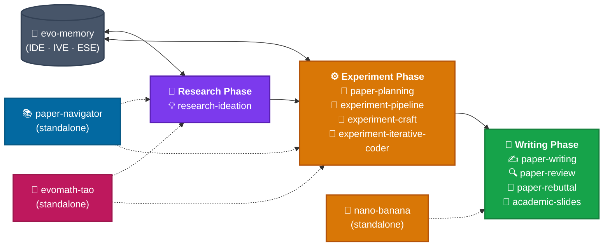

# 🧬 EvoSkills

**The official skill repository for [EvoScientist](https://github.com/EvoScientist/EvoScientist). Each skill is an installable knowledge pack that extends EvoScientist with domain-specific expertise.**

## 📦 Installation

> [!IMPORTANT]
> These skills are purpose-built for EvoScientist — together they amplify each other, unlocking the full potential of both the agent and the skills. Under EvoScientist, skills evolve across research cycles through persistent memory (evo-memory).

### In-session commands

Install all skills at once:

```bash
/install-skill EvoScientist/EvoSkills@skills
```

Or install a single skill:

```bash
/install-skill EvoScientist/EvoSkills@skills/paper-planning
```

### Ask EvoScientist directly

Simply ask the agent in conversation:

```text
"Install all skills from EvoScientist/EvoSkills@skills."
```

> [!TIP]
> **Not using EvoScientist?** These skills are compatible with any coding agent.
> One command via [**skills.sh**](https://skills.sh/) to install on Claude Code, OpenCode, Cursor, Codex, Gemini CLI, DeepAgents, and more:
> ```bash
> npx skills add EvoScientist/EvoSkills
> ```


## ✨ Available Skills

| Skill | Description |
| ----- | ----------- |
| [`research-ideation`](#-research-ideation--literature-grounding--tournament--proposal) | 💡 Literature grounding, tournament ranking & proposal generation |
| [`paper-planning`](#-paper-planning--research-paper-planning--outline-generation) | 📐 Research paper planning & outline generation |
| [`experiment-pipeline`](#-experiment-pipeline--4-stage-experiment-execution) | 🧪 Structured 4-stage experiment execution |
| [`experiment-craft`](#-experiment-craft--experiment-debugging--iteration) | 🔧 Experiment debugging, logging & iteration |
| [`experiment-iterative-coder`](#-experiment-iterative-coder--iterative-code-refinement) | 🔄 Iterative code refinement (plan → code → evaluate → refine) |
| [`paper-writing`](#-paper-writing--section-by-section-paper-drafting) | ✍️ End-to-end paper writing assistance |
| [`paper-review`](#-paper-review--self-review--quality-assurance) | 🔍 Automated paper review & feedback |
| [`paper-rebuttal`](#-paper-rebuttal--rebuttal-writing-after-peer-review) | 💬 Rebuttal writing after peer review |
| [`academic-slides`](#-academic-slides--presentation--research-talk-creation) | 🎤 Academic presentation & research talk creation |
| [`evo-memory`](#-evo-memory--persistent-research-memory--self-evolution) | 🧠 Persistent research memory & self-evolution |
| [`paper-navigator`](#-paper-navigator--academic-paper-discovery--reading) | 📚 Academic paper discovery, evaluation & reading |
| [`research-survey`](#-research-survey--literature-survey--synthesis) | 📝 Structured literature survey synthesis |
| [`nano-banana`](#-nano-banana--ai-generated-slides--illustrations) | 🍌 AI-generated presentation slides & illustrations via Gemini |
| [`evomath-tao`](#-evomath-tao--tao-style-olympiad-proof-workflow) | 🧮 Tao-style olympiad-grade proof workflow with calibrated abstention |

> **Paper Suite + Self-Evolution Suite**: Each skill is self-contained — use them individually or combine freely. The self-evolution loop now runs through `research-ideation`, `experiment-pipeline`, and `evo-memory`.

## 🔌 MCP Server Marketplace

The [`mcp/`](./mcp/) directory contains a curated collection of [MCP](https://modelcontextprotocol.io/) servers that extend agents with external tools — web search, academic paper retrieval, documentation lookup, and more. Browse the [full list](./mcp/README.md) or install directly:

```bash
/install-mcp              # interactive browser
EvoSci mcp install arxiv  # install by name
```

### ⛳️ Framework Overview

<p align="center">
  
</p>

The diagram above shows the full EvoScientist pipeline. The **Researcher Agent** (top, blue) runs idea tree search and Elo tournament ranking to produce a research proposal. The **Engineer Agent** (bottom, green) executes the 4-stage experiment pipeline. The **Evolution Manager Agent** (right) manages three memory evolution mechanisms — IDE, IVE, and ESE — that feed learned knowledge back into **Ideation Memory (M_I)** and **Experimentation Memory (M_E)** for future cycles.

#### 🎢 Skill Pipeline



---

### 💡 `research-ideation` — Literature Grounding, Tournament & Proposal

The starting point of the research pipeline. It now covers the full path from literature grounding to ranked ideas to a concrete proposal:

- **Load Prior Knowledge** — Read `evo-memory` first to reuse feasible directions and avoid known dead ends
- **Literature Grounding** — Use `paper-navigator` to collect and analyze papers before generating ideas
- **Multi-Track Ideation + Refinement** — Generate candidates across multiple personas, then iteratively strengthen them
- **Elo Tournament** — Rank refined ideas on novelty, feasibility, relevance, and clarity; present the top-3
- **Proposal Extension** — Expand the selected winner into a manuscript-quality research proposal

### 📝 `research-survey` — Literature Survey & Synthesis

Dedicated skill for turning a large paper collection into a structured survey report:

- **Adaptive Outline** — Generate a field-specific outline based on the query type and literature set
- **Draft + Expansion Pipeline** — Draft from top papers, then deepen each section with the full collection
- **Summary Refinement** — Build section summaries before rewriting the abstract, introduction, and conclusion
- **Survey-Grade Output** — Comparative tables, taxonomy-based method organization, dense citations, and references

### 📐 `paper-planning` — Research Paper Planning & Outline Generation

Guides pre-writing planning before a single word is drafted. Covers four key activities:

- **Story Design** — Reverse-engineer the narrative: task → challenge → insight → contribution → advantage
- **Experiment Planning** — Plan comparisons, ablations, and demo scenarios with structured checklists
- **Figure Design** — Pipeline figures that highlight novelty; teaser figures that hook reviewers
- **Timeline Management** — 4-week countdown schedule from outline to submission

Includes counterintuitive tactics: write your rejection letter first, narrow claims before broadening, and plan fallback narratives.

### 🧪 `experiment-pipeline` — 4-Stage Experiment Execution

A structured framework for executing research experiments with attempt budgets and gate conditions:

- **Stage 1: Initial Implementation** — Get baseline code running and reproduce known results (≤20 attempts)
- **Stage 2: Hyperparameter Tuning** — Optimize configuration for your setup (≤12 attempts)
- **Stage 3: Proposed Method** — Implement and validate the novel method (≤12 attempts)
- **Stage 4: Ablation Study** — Prove each component's contribution (≤18 attempts)
- **Code Trajectory Logging** — Structured attempt logging that feeds into `evo-memory`
- **Counterintuitive Rules** — Initial implementation is not wasted time; budget limits prevent rabbit holes; failed attempts are data

Integrates with `experiment-craft` for failure diagnosis within stages and `evo-memory` for cross-cycle learning.

### 🔧 `experiment-craft` — Experiment Debugging & Iteration

A systematic approach to experiment debugging, logging, and iterative improvement:

- **5-Step Diagnostic Flow** — Collect failures → find a working version → bridge the gap → hypothesize → fix
- **Counterintuitive Rules** — Change one variable at a time; effective experiments beat more experiments
- **Experiment Logging** — 5-section structured log template for reproducible records
- **Handoff to Paper-Writing** — Feed validated results and logs into `paper-writing` for drafting

### 🔄 `experiment-iterative-coder` — Iterative Code Refinement

Structured plan → code → evaluate → refine cycles for higher code quality:

- **Phase Decomposition** — Break complex tasks into 1-5 sequential phases
- **Iteration Loop** — Up to 3 iterations per phase (10 total): plan, code, run lint/tests, score, decide
- **Objective Evaluation** — ruff lint + pytest with dynamic score weighting and hard caps
- **Failure Mode Guidance** — Targeted responses for timeout, syntax, import, test, and lint failures

Integrates with `experiment-craft` for stuck diagnoses and `evo-memory` for loading prior strategies.

### ✍️ `paper-writing` — Section-by-Section Paper Drafting

A proven 11-step workflow for writing academic papers with LaTeX templates:

- **Structured Process** — From pipeline sketch → story design → Method → Experiments → Related Work → Abstract → Title
- **Section Templates** — Three Abstract templates, four Introduction openers, Method module structure, Experiments organization
- **LaTeX Assets** — Annotated paper skeleton (`paper-skeleton.tex`) and booktabs table macros (`table-style.tex`)
- **Writing Principles** — One message per paragraph, topic sentence first, terminology consistency, reverse-outlining
- **Counterintuitive Tactics** — Underclaim in prose / overdeliver in evidence; lead with mechanism, not just metrics

### 🔍 `paper-review` — Self-Review & Quality Assurance

Systematic self-review before submission using adversarial and counterintuitive review strategies:

- **5-Aspect Checklist** — Contribution sufficiency, writing clarity, results quality, testing completeness, method design
- **Reverse-Outlining** — Extract the outline from finished paragraphs to verify logical flow
- **Figure & Table Quality Checks** — Captions, resolution, booktabs, color-blind friendliness
- **Rejection Simulation** — Force a reject summary first; attack your own novelty claim
- **Handoff to Rebuttal** — After review, feed identified weaknesses into `paper-rebuttal` for response preparation

### 💬 `paper-rebuttal` — Rebuttal Writing After Peer Review

Dedicated rebuttal skill for responding to reviewer feedback after peer review:

- **Score Diagnosis** — Color-code every reviewer comment: red (critical), orange (important), gray (minor), green (positive)
- **Champion Strategy** — Arm your most positive reviewer with evidence for the Area Chair discussion
- **Tactical Writing** — 18 rules for structure, content, and tone in rebuttal responses
- **Counterintuitive Principles** — Submit even with extreme scores; concede small points to win the big argument
- **Common Concerns** — Response strategies for 12 frequently raised reviewer complaints

### 🎤 `academic-slides` — Presentation & Research Talk Creation

A structured approach to creating academic presentations and preparing research talks:

- **Narrative Arc** — Define scope, audience, and key takeaway before touching slides
- **Slide Design** — 10 design rules, visual hierarchy, one idea per slide, claim-style titles
- **Practical Creation** — `.pptx` file generation with color palettes, layout code, charts, and figures
- **Delivery & Q&A** — Rehearsal protocol, timing, and backup slide preparation
- **Counterintuitive Rules** — Slides are not your paper; enthusiasm beats polish; related work builds motivation, not citation counts

### 🧠 `evo-memory` — Persistent Research Memory & Self-Evolution

The learning layer that accumulates knowledge across research cycles. Maintains two memory stores and implements three evolution mechanisms:

- **Ideation Memory (M_I)** — Tracks feasible and unsuccessful research directions across ideation cycles
- **Experimentation Memory (M_E)** — Stores reusable data processing and model training strategies (paper core), plus architecture and debugging (extensions)
- **IDE (Idea Direction Evolution)** — Extracts promising directions after `research-ideation`
- **IVE (Idea Validation Evolution)** — Classifies experiment failures as implementation vs fundamental direction failures
- **ESE (Experiment Strategy Evolution)** — Distills reusable patterns from successful experiment pipelines

Read by `research-ideation` and `experiment-pipeline` at cycle start; updated after each cycle completes.

### 📚 `paper-navigator` — Academic Paper Discovery & Reading

Focused paper workflow in four stages — from query to evaluated reading list:

- **Disambiguate** — Analyze user intent, resolve ambiguous terms (project names, module names) to actual paper titles
- **Discover** — 7 discovery paths: keyword search, citation traversal, recommendations, author tracking, arXiv monitoring, trending detection, GitHub search
- **Evaluate** — Quick assessment via TLDR, citations, code availability (HuggingFace + GitHub), and top models by task
- **Read** — Full-text retrieval via Jina Reader with 3-level reading strategy (Technical, Analytical, Contextual)
Includes Python scripts powered by Semantic Scholar, HuggingFace, GitHub, arXiv, and Jina Reader APIs.

### 🍌 `nano-banana` — AI-Generated Slides & Illustrations

Generate professional presentation slides and high-quality illustrations using Gemini's image generation API, with an interactive browser-based review loop:

- **7-Phase Workflow** — Content planning conversation → slides_plan.json → style selection & batch generation → browser review → feedback editing → PPTX packaging → cleanup
- **3 Visual Styles** — Lineal Color (flat icons, educational), Gradient Glass (glassmorphism, premium), Vector Illustration (retro, approachable)
- **Interactive Review** — Local HTTP server with per-slide feedback; edits are applied without regenerating the entire deck
- **Multi-Model Support** — `gemini-3-pro-image-preview` (best quality), `gemini-3.1-flash-image-preview` (fast iteration), `gemini-2.5-flash-image` (rapid prototyping)
- **Counterintuitive Rules** — More planning = better slides; edit don't regenerate; never read generated images yourself (use the review server)

### 🧮 `evomath-tao` — Tao-style Olympiad Proof Workflow

A rigorous proof workflow that operationalizes Terence Tao's research-math practice for contest-style mathematics. Outputs a complete proof, a verified counterexample, a calibrated partial result, or a clean handoff — never a hand-waved "PROVED":

- **5-Step Protocol** — Plan Briefly → Try Candidates → Assemble → Audit → Reflect, driven by TodoWrite + per-phase validators
- **5-Round Internal Mini-Process per Candidate** — Solve → Self-improve → Self-verify → Correct → Repeat. **No tool use during Solve** (pencil-and-paper discipline)
- **5 Honest Status Labels** — `PROVED` / `REFUTED` / `VERIFIED_NUMERICALLY` / `CONJECTURED` / `HANDED_OFF`. Numerical evidence is NOT a proof
- **3-Safeguard Audit** — Verifier context isolation, asymmetric voting (4 HOLDS to confirm, 2 HOLE FOUND to refute), pigeonhole exit
- **Named-Pattern Screen** — Library of recurring failure modes (P4, P5, P6, P18, P40, P41) checked before any PROVED award
- **Calibrated Abstention** — When verification fails repeatedly, the skill downgrades the status instead of bluffing

**IMO 2025 evaluation (Claude Opus 4.7, 6 parallel subagents):** 4 PROVED (P1 / P2 / P4 / P5) · 1 CONJECTURED (P3, c = 4 with odd-prime gap) · 1 HANDED_OFF (P6, 2112 sketched). All 6 numeric/classification answers match the official IMO 2025 keys.

<p align="right"><a href="#top">🔝Back to top</a></p>

## 🎯 ᯓ➤ Roadmap

Completed:
- [x] 🧠 **Self-Evolution Suite** — `research-ideation`, `experiment-pipeline`, `evo-memory`
- [x] 📚 **Literature Survey** — Systematic literature search, filtering, and survey generation
- [x] 🔄 **Iterative Coder** — Iterative code refinement with plan → code → evaluate → refine cycles
- [x] 🎨 **Visual Generation** — AI-generated slides & illustrations (`nano-banana`)
- [x] 🏅 **Math Olympiad** — Tao-style proof workflow with calibrated abstention (`evomath-tao`)

Coming soon:
- [ ] 🔬 **Paper Reproduction** — Read a paper, reproduce its core results, and verify claims
- [ ] 💡 **Grant & Proposal Writing** — Research proposal drafting with funding agency conventions
- [ ] 🤖 **Peer Debate** — Multi-agent adversarial discussion to stress-test research ideas
- [ ] 📈 **Trend Radar** — Analyze publication trends, identify emerging topics & research gaps
- [ ] 🗣️ **Paper QA** — Interactive question-answering over paper collections, extracting key findings & cross-referencing claims

Stay tuned — more skills are on the way!

<p align="right"><a href="#top">🔝Back to top</a></p>

## 🌍 Project Roles

<table>
  <tbody>
    <tr>
      <td align="center">
        <a href="https://github.com/EvoScientist/EvoScientist">
          
          <br />
          <sub><b>EvoScientist</b></sub>
        </a>
      </td>
      <td align="center">
        <a href="https://x-izhang.github.io/">
          
          <br />
          <sub><b>Xi Zhang</b></sub>
        </a>
      </td>
      <td align="center">
        <a href="https://youganglyu.github.io/">
          
          <br />
          <sub><b>Yougang Lyu</b></sub>
        </a>
      </td>
      <td align="center">
        <a href="https://din0s.me/">
          
          <br />
          <sub><b>Dinos Papakostas</b></sub>
        </a>
      </td>
      <td align="center">
        <a href="https://go0day.github.io/">
          
          <br />
          <sub><b>Yuyue Zhao</b></sub>
        </a>
      </td>
    </tr>
  </tbody>
</table>

> <a href="https://xiaoyi.huawei.com/chat/research"></a> [*Xiaoyi DeepResearch*](https://xiaoyi.huawei.com/chat/research) *Team* and the wider open-source community contribute to this project.

For any enquiries or collaboration opportunities, please contact: [**EvoScientist.ai@gmail.com**](mailto:evoscientist.ai@gmail.com)

<p align="right"><a href="#top">🔝Back to top</a></p>

## 🤝 Contributing

We welcome contributions! See the guides for [skills](./skills/README.md) and [MCP servers](./mcp/README.md), or start with the [Contributing Guidelines](./CONTRIBUTING.md).

Every contribution brings us one step closer to a future where AI accelerates scientific breakthroughs for all of humanity.

<a href="https://github.com/EvoScientist/EvoSkills/graphs/contributors">
  
</a>

### 📈 Star History

[](https://www.star-history.com/?repos=EvoScientist%2FEvoSkills&type=date&legend=bottom-right)

<p align="right"><a href="#top">🔝Back to top</a></p>

## 📝 Citation

If you find our paper and code useful in your research and applications, please cite using this BibTeX:

```bibtex
@article{evoscientist2026, 
  title={EvoScientist: Towards Multi-Agent Evolving AI Scientists for End-to-End Scientific Discovery}, 
  author={Yougang Lyu and Xi Zhang and Xinhao Yi and Yuyue Zhao and Shuyu Guo and Wenxiang Hu and Jan Piotrowski and Jakub Kaliski and Jacopo Urbani and Zaiqiao Meng and Lun Zhou and Xiaohui Yan}, 
  journal={arXiv preprint arXiv:2603.08127}, 
  year={2026} 
}
```

<p align="right"><a href="#top">🔝Back to top</a></p>

## 📜 License

This project is licensed under the Apache License 2.0 - see the [LICENSE](./LICENSE) file for details.

<p align="right"><a href="#top">🔝Back to top</a></p>
