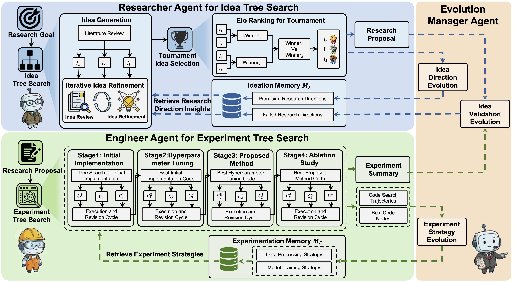
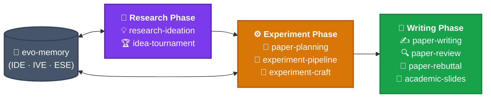

# 🧬 EvoSkills

**The official skill repository for [EvoScientist](https://github.com/EvoScientist/EvoScientist). Each skill is an installable knowledge pack that extends EvoScientist with domain-specific expertise.**

## 📦 Installation

### In-session commands with EvoScientist

Install all skills at once:

```bash
/install-skill EvoScientist/EvoSkills@skills
```

Or install a single skill:

```bash
/install-skill EvoScientist/EvoSkills@skills/paper-planning
```

### Ask EvoScientist directly

Simply ask the agent in conversation:

```text
"Install all skills from EvoScientist/EvoSkills@skills."
```

> [!TIP]
> These skills also work with other coding agents! Install to any agent (Claude Code, OpenCode, Cursor, Codex, Gemini CLI, Qwen Code) with one command via [skills.sh](https://skills.sh/):
> ```bash
> npx skills add EvoScientist/EvoSkills
> ```


## ✨ Available Skills

| Skill | Description |
| ----- | ----------- |
| [`research-ideation`](#-research-ideation--literature-tree--problem-finding) | 💡 Research ideation, literature tree & problem finding |
| [`idea-tournament`](#-idea-tournament--competitive-idea-ranking--proposal-generation) | 🏆 Competitive idea ranking & proposal generation |
| [`paper-planning`](#-paper-planning--research-paper-planning--outline-generation) | 📐 Research paper planning & outline generation |
| [`experiment-pipeline`](#-experiment-pipeline--4-stage-experiment-execution) | 🧪 Structured 4-stage experiment execution |
| [`experiment-craft`](#-experiment-craft--experiment-debugging--iteration) | 🔧 Experiment debugging, logging & iteration |
| [`paper-writing`](#-paper-writing--section-by-section-paper-drafting) | ✍️ End-to-end paper writing assistance |
| [`paper-review`](#-paper-review--self-review--quality-assurance) | 🔍 Automated paper review & feedback |
| [`paper-rebuttal`](#-paper-rebuttal--rebuttal-writing-after-peer-review) | 💬 Rebuttal writing after peer review |
| [`academic-slides`](#-academic-slides--presentation--research-talk-creation) | 🎤 Academic presentation & research talk creation |
| [`evo-memory`](#-evo-memory--persistent-research-memory--self-evolution) | 🧠 Persistent research memory & self-evolution |

> **Paper Suite + Self-Evolution Suite**: Each skill is self-contained — use them individually or combine freely. The self-evolution skills (`idea-tournament`, `experiment-pipeline`, `evo-memory`) form a learning loop that improves across research cycles.

### ⛳️ Framework Overview

<p align="center">
  
</p>

The diagram above shows the full EvoScientist pipeline. The **Researcher Agent** (top, blue) runs idea tree search and Elo tournament ranking to produce a research proposal. The **Engineer Agent** (bottom, green) executes the 4-stage experiment pipeline. The **Evolution Manager Agent** (right) manages three memory evolution mechanisms — IDE, IVE, and ESE — that feed learned knowledge back into **Ideation Memory (M_I)** and **Experimentation Memory (M_E)** for future cycles.

#### 🎢 Skill Pipeline



---

### 💡 `research-ideation` — Literature Tree & Problem Finding

The starting point of the research pipeline. Guides ideation from literature analysis to solution design:

- **Literature Tree** — Build a novelty tree and challenge-insight tree to map the research landscape
- **Problem Selection** — 4-level well-established solution check to identify open problems worth pursuing
- **Solution Design** — Cross-domain transfer and problem decomposition strategies
- **Paper Reading** — 3-level structured Q&A methodology for deep comprehension
- **Counterintuitive Rules** — Problem selection matters more than solution design; pursue new failure cases rather than incremental improvements

### 🏆 `idea-tournament` — Competitive Idea Ranking & Proposal Generation

Bridges the gap between having a research direction and having a concrete, validated proposal:

- **Tree-Structured Generation** — Expand a seed idea into up to N_I=21 candidates by varying technique, domain, and formulation axes
- **Elo Tournament** — Pairwise comparisons on 4 dimensions (novelty, feasibility, relevance, clarity) with Swiss-system pairing
- **Direction Summarization** — Synthesize top-3 ideas into promising directions for evo-memory
- **Proposal Extension** — Extend the winning idea into a full research proposal (5 sections from paper + 1 practical extension)
- **Counterintuitive Rules** — Quantity before quality; the tournament finds surprises; top-3 not top-1

### 📐 `paper-planning` — Research Paper Planning & Outline Generation

Guides pre-writing planning before a single word is drafted. Covers four key activities:

- **Story Design** — Reverse-engineer the narrative: task → challenge → insight → contribution → advantage
- **Experiment Planning** — Plan comparisons, ablations, and demo scenarios with structured checklists
- **Figure Design** — Pipeline figures that highlight novelty; teaser figures that hook reviewers
- **Timeline Management** — 4-week countdown schedule from outline to submission

Includes counterintuitive tactics: write your rejection letter first, narrow claims before broadening, and plan fallback narratives.

### 🧪 `experiment-pipeline` — 4-Stage Experiment Execution

A structured framework for executing research experiments with attempt budgets and gate conditions:

- **Stage 1: Initial Implementation** — Get baseline code running and reproduce known results (≤20 attempts)
- **Stage 2: Hyperparameter Tuning** — Optimize configuration for your setup (≤12 attempts)
- **Stage 3: Proposed Method** — Implement and validate the novel method (≤12 attempts)
- **Stage 4: Ablation Study** — Prove each component's contribution (≤18 attempts)
- **Code Trajectory Logging** — Structured attempt logging that feeds into `evo-memory`
- **Counterintuitive Rules** — Initial implementation is not wasted time; budget limits prevent rabbit holes; failed attempts are data

Integrates with `experiment-craft` for failure diagnosis within stages and `evo-memory` for cross-cycle learning.

### 🔧 `experiment-craft` — Experiment Debugging & Iteration

A systematic approach to experiment debugging, logging, and iterative improvement:

- **5-Step Diagnostic Flow** — Collect failures → find a working version → bridge the gap → hypothesize → fix
- **Counterintuitive Rules** — Change one variable at a time; effective experiments beat more experiments
- **Experiment Logging** — 5-section structured log template for reproducible records
- **Handoff to Paper-Writing** — Feed validated results and logs into `paper-writing` for drafting

### ✍️ `paper-writing` — Section-by-Section Paper Drafting

A proven 11-step workflow for writing academic papers with LaTeX templates:

- **Structured Process** — From pipeline sketch → story design → Method → Experiments → Related Work → Abstract → Title
- **Section Templates** — Three Abstract templates, four Introduction openers, Method module structure, Experiments organization
- **LaTeX Assets** — Annotated paper skeleton (`paper-skeleton.tex`) and booktabs table macros (`table-style.tex`)
- **Writing Principles** — One message per paragraph, topic sentence first, terminology consistency, reverse-outlining
- **Counterintuitive Tactics** — Underclaim in prose / overdeliver in evidence; lead with mechanism, not just metrics

### 🔍 `paper-review` — Self-Review & Quality Assurance

Systematic self-review before submission using adversarial and counterintuitive review strategies:

- **5-Aspect Checklist** — Contribution sufficiency, writing clarity, results quality, testing completeness, method design
- **Reverse-Outlining** — Extract the outline from finished paragraphs to verify logical flow
- **Figure & Table Quality Checks** — Captions, resolution, booktabs, color-blind friendliness
- **Rejection Simulation** — Force a reject summary first; attack your own novelty claim
- **Handoff to Rebuttal** — After review, feed identified weaknesses into `paper-rebuttal` for response preparation

### 💬 `paper-rebuttal` — Rebuttal Writing After Peer Review

Dedicated rebuttal skill for responding to reviewer feedback after peer review:

- **Score Diagnosis** — Color-code every reviewer comment: red (critical), orange (important), gray (minor), green (positive)
- **Champion Strategy** — Arm your most positive reviewer with evidence for the Area Chair discussion
- **Tactical Writing** — 18 rules for structure, content, and tone in rebuttal responses
- **Counterintuitive Principles** — Submit even with extreme scores; concede small points to win the big argument
- **Common Concerns** — Response strategies for 12 frequently raised reviewer complaints

### 🎤 `academic-slides` — Presentation & Research Talk Creation

A structured approach to creating academic presentations and preparing research talks:

- **Narrative Arc** — Define scope, audience, and key takeaway before touching slides
- **Slide Design** — 10 design rules, visual hierarchy, one idea per slide, claim-style titles
- **Practical Creation** — `.pptx` file generation with color palettes, layout code, charts, and figures
- **Delivery & Q&A** — Rehearsal protocol, timing, and backup slide preparation
- **Counterintuitive Rules** — Slides are not your paper; enthusiasm beats polish; related work builds motivation, not citation counts

### 🧠 `evo-memory` — Persistent Research Memory & Self-Evolution

The learning layer that accumulates knowledge across research cycles. Maintains two memory stores and implements three evolution mechanisms:

- **Ideation Memory (M_I)** — Tracks feasible and unsuccessful research directions across idea tournaments
- **Experimentation Memory (M_E)** — Stores reusable data processing and model training strategies (paper core), plus architecture and debugging (extensions)
- **IDE (Idea Direction Evolution)** — Extracts promising directions after idea tournaments
- **IVE (Idea Validation Evolution)** — Classifies experiment failures as implementation vs fundamental direction failures
- **ESE (Experiment Strategy Evolution)** — Distills reusable patterns from successful experiment pipelines

Read by `idea-tournament` and `experiment-pipeline` at cycle start; updated after each cycle completes.

<p align="right"><a href="#top">🔝Back to top</a></p>

## 🎯 ᯓ➤ Roadmap

Coming soon:
- [x] 🧠 **Self-Evolution Suite** — `idea-tournament`, `experiment-pipeline`, `evo-memory`
- [ ] 🏅 **Math Olympiad** — Advanced mathematical reasoning & problem solving
- [ ] 🎨 **Visual Generation** — Diagrams, figures & graphic content creation
- [ ] 📚 **Literature Survey** — Systematic literature search, filtering, and survey generation
- [ ] 🔬 **Paper Reproduction** — Read a paper, reproduce its core results, and verify claims
- [ ] 💡 **Grant & Proposal Writing** — Research proposal drafting with funding agency conventions
- [ ] 🤖 **Peer Debate** — Multi-agent adversarial discussion to stress-test research ideas
- [ ] 📈 **Trend Radar** — Analyze publication trends, identify emerging topics & research gaps
- [ ] 🗣️ **Paper QA** — Interactive question-answering over paper collections, extracting key findings & cross-referencing claims

Stay tuned — more skills are on the way!

<p align="right"><a href="#top">🔝Back to top</a></p>

## 🌍 Project Roles

<table>
  <tbody>
    <tr>
      <td align="center">
        <a href="https://github.com/EvoScientist/EvoScientist">
          
          <br />
          <sub><b>EvoScientist</b></sub>
        </a>
      </td>
      <td align="center">
        <a href="https://x-izhang.github.io/">
          
          <br />
          <sub><b>Xi Zhang</b></sub>
        </a>
      </td>
      <td align="center">
        <a href="https://youganglyu.github.io/">
          
          <br />
          <sub><b>Yougang Lyu</b></sub>
        </a>
      </td>
    </tr>
  </tbody>
</table>

> <a href="https://xiaoyi.huawei.com/chat/research"></a> [*Xiaoyi DeepResearch*](https://xiaoyi.huawei.com/chat/research) *Team* and the wider open-source community contribute to this project.

For any enquiries or collaboration opportunities, please contact: [**EvoScientist.ai@gmail.com**](mailto:evoscientist.ai@gmail.com)

<p align="right"><a href="#top">🔝Back to top</a></p>

## 🤝 Contributing

We welcome contributions! See our [Contributing Guidelines](./CONTRIBUTING.md) for how to improve existing skills or add new ones.

### 📈 Star History

[](https://www.star-history.com/#EvoScientist/EvoSkills&type=date&legend=top-left)

<p align="right"><a href="#top">🔝Back to top</a></p>

## 📝 Citation

If you find our paper and code useful in your research and applications, please cite using this BibTeX:

```bibtex
@article{evoscientist2026, 
  title={EvoScientist: Towards Multi-Agent Evolving AI Scientists for End-to-End Scientific Discovery}, 
  author={Yougang Lyu and Xi Zhang and Xinhao Yi and Yuyue Zhao and Shuyu Guo and Wenxiang Hu and Jan Piotrowski and Jakub Kaliski and Jacopo Urbani and Zaiqiao Meng and Lun Zhou and Xiaohui Yan}, 
  journal={arXiv preprint arXiv:2603.08127}, 
  year={2026} 
}
```

<p align="right"><a href="#top">🔝Back to top</a></p>

## 📜 License

This project is licensed under the Apache License 2.0 - see the [LICENSE](./LICENSE) file for details.

<p align="right"><a href="#top">🔝Back to top</a></p>

---

<p align="center">
  Created and maintained by <a href="https://github.com/x-izhang"><b>Xi Zhang</b></a>, built with the open-source community.
</p>