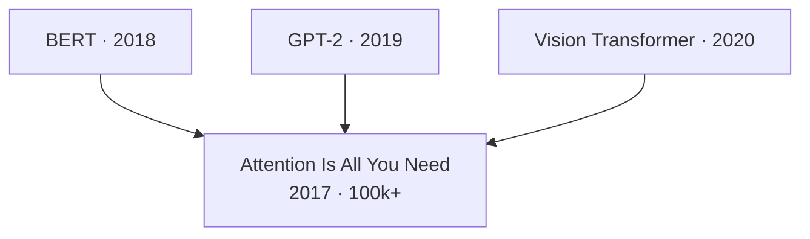

# Paper Navigator

End-to-end paper workflow in four stages:

```
┌──────────┐    ┌──────────┐    ┌──────────┐    ┌──────────┐
│ Discover │ →  │ Evaluate │ →  │   Read   │ →  │ Organize │
│ 发现论文  │    │ 筛选评估  │    │ 深度阅读  │    │ 文献图谱  │
└──────────┘    └──────────┘    └──────────┘    └──────────┘
```

| Stage | Input | Scripts | Output |
|-------|-------|---------|--------|
| Discover | keywords / author / field | `scholar_search`, `citation_traverse`, `recommend`, `author_search`, `arxiv_monitor`, `trending` | candidate list |
| Evaluate | candidate list | `scholar_search` (TLDR/citations), `find_code`, `sota`, `dataset_search` | reading list |
| Read | paper ID / URL | `fetch_paper` + `references/reading-strategy.md` | structured notes |
| Organize | multiple notes | (agent applies framework — no script) | literature map |

**Setup:** All scripts use `httpx` (already in project). Optional env vars for higher rate limits:
- `S2_API_KEY` — Semantic Scholar ([request here](https://www.semanticscholar.org/product/api#api-key))
- `JINA_API_KEY` — Jina Reader (free tier works without key)

Scripts are in `EvoScientist/skills/paper-navigator/scripts/`. Run via `python EvoScientist/skills/paper-navigator/scripts/<name>.py`.

---

## Stage 1: Discover

Six discovery paths, ordered by frequency of use.

### Path A: Keyword Search (most common)

```bash
python scripts/scholar_search.py --query "transformer attention mechanism" --limit 20 --sort-by citations
```

Options: `--year-min/--year-max`, `--open-access-only`, `--sort-by relevance|citations|year`.

Returns: title, authors, year, citations, TLDR, OA PDF link.

### Path B: Citation Traversal (from a seed paper)

```bash
# Forward — who cited this paper
python scripts/citation_traverse.py --paper-id ArXiv:1706.03762 --direction forward --limit 20

# Backward — what this paper cites
python scripts/citation_traverse.py --paper-id ArXiv:1706.03762 --direction backward --limit 20

# Co-citation — papers frequently cited alongside this one (sister works)
python scripts/citation_traverse.py --paper-id ArXiv:1706.03762 --direction co-citation --limit 15
```

Co-citation is the most powerful discovery method — it finds closely related work that keyword search misses.

### Path C: "More Like This" Recommendations

```bash
python scripts/recommend.py --positive ArXiv:1706.03762,ArXiv:2005.14165 --limit 15
# Optionally exclude certain directions:
python scripts/recommend.py --positive ArXiv:1706.03762 --negative ArXiv:2301.00001 --limit 10
```

### Path D: Author Tracking

```bash
python scripts/author_search.py --name "Geoffrey Hinton" --papers --limit 20 --sort-by citations
```

### Path E: New Paper Monitoring

```bash
# By category (see references/arxiv-categories.md for codes)
python scripts/arxiv_monitor.py --categories cs.CL,cs.AI --days 3 --limit 30

# By keywords
python scripts/arxiv_monitor.py --keywords "chain of thought,reasoning" --days 7
```

### Path F: Trending Detection

```bash
python scripts/trending.py --query "large language models" --period 90 --limit 15
```

Ranks by citation velocity (citations/month). Useful for finding rapidly rising papers.

### Citation Graph Visualization

After traversal, visualize with Mermaid (keep ≤30 nodes):



---

## Stage 2: Evaluate

Goal: filter candidates into a reading list. Use data already returned by Discover scripts plus targeted checks.

### Quick Assessment (from scholar_search output)

| Signal | What it tells you |
|--------|-------------------|
| TLDR | One-sentence understanding |
| Citation count | Overall impact |
| Influential citations | Quality of impact |
| Year + venue | Recency and authority |
| Open Access PDF | Whether you can read full text |

### Code Availability Check

```bash
python scripts/find_code.py --arxiv-id 1706.03762
```

Returns: GitHub URLs, stars, framework, whether official implementation.

### SOTA Ranking

```bash
python scripts/sota.py --task "Machine Translation" --dataset "WMT14 EN-DE"
# List available tasks first:
python scripts/sota.py --task "Machine Translation" --list-tasks
# List datasets for a task:
python scripts/sota.py --task "Machine Translation" --list-datasets
```

### Dataset Discovery

```bash
python scripts/dataset_search.py --query "sentiment analysis" --limit 10
```

### Reproducibility Assessment

After gathering the above, assess each paper:

| Dimension | Check | Score |
|-----------|-------|-------|
| Code | Open-source? Official? Stars? Last update? | |
| Results | Reproduced on SOTA leaderboard? | |
| Data | Dataset publicly available? | |
| **Overall** | | High / Medium / Low / None |

---

## Stage 3: Read

### Fetch Full Text

```bash
# By paper ID (auto-resolves to best URL via S2 metadata)
python scripts/fetch_paper.py --paper-id ArXiv:1706.03762

# By direct URL
python scripts/fetch_paper.py --url "https://arxiv.org/abs/1706.03762"

# Metadata only (no full text fetch)
python scripts/fetch_paper.py --paper-id ArXiv:1706.03762 --metadata-only
```

Uses Jina Reader (`r.jina.ai`) to convert any paper URL to clean Markdown. Works with arXiv HTML, PDF links, and publisher pages.

### Choose Reading Depth

| Level | Goal | When to use | Effort |
|-------|------|-------------|--------|
| **L1 Technical** | Can reimplement the method | Building directly on this paper | High |
| **L2 Analytical** | Understand motivation, design choices, tradeoffs | Most papers in your survey | Medium |
| **L3 Contextual** | Know what it is and where it fits | Quick scanning, staying current | Low |

Most papers need only L2-L3. Reserve L1 for papers you will build upon.

Detailed reading methodology: `references/reading-strategy.md`

### Take Notes

Use the template at `assets/paper-summary-template.md`. Save notes to `/artifacts/paper-notes/{paper-id}.md`.

Key questions to answer:
1. What problem does this paper address?
2. What is the key contribution (one sentence)?
3. What is the key technical insight?
4. What are the limitations (stated and unstated)?
5. How does this relate to my research?

---

## Stage 4: Organize

After reading multiple papers, build two structures to map the literature.

### Novelty Tree

Classify each paper:

| Type | Meaning | Novelty |
|------|---------|---------|
| 1 | Milestone — defines a new task or paradigm | Highest |
| 2 | New pipeline or data representation | High |
| 3 | New module or component | Medium |
| 4 | Incremental improvement on existing approach | Low |

### Challenge-Insight Tree

Build a many-to-many mapping:

1. **Extract challenges:** From each paper, what technical problem does it solve?
2. **Extract insights:** What technique or key idea does it use?
3. **Build the map:**

```
Challenge: Long-range dependencies in sequences
├── Insight: Self-attention (Transformer)
├── Insight: State-space models (Mamba)
└── Insight: Linear attention approximation

Challenge: Quadratic attention cost
├── Insight: Sparse attention patterns
├── Insight: Linear attention
└── Insight: IO-aware computation (Flash Attention)
```

4. **Analyze the map:**
   - Challenges with many solutions → well-studied area
   - Challenges with few solutions → **research opportunity**
   - Insights that solve many challenges → powerful, versatile technique
   - Insights not yet applied to a challenge → **potential for transfer**

Save to `/artifacts/literature-tree.md` and update incrementally.

---

## Common Workflows

### Workflow 1: Comprehensive Literature Survey (full pipeline)

> "Help me survey transformers in medical imaging"

1. **Discover:** `scholar_search --query "transformer medical imaging" --limit 20 --sort-by citations` → pick top results → `citation_traverse --direction forward` on seminal papers
2. **Evaluate:** Review TLDR + citations → shortlist top 10 → `find_code` to check reproducibility
3. **Read:** `fetch_paper` for top 5 → L2 reading → notes using template
4. **Organize:** Classify by novelty type → build challenge-insight tree → output survey report

### Workflow 2: Find and Read a Specific Paper

> "Find Attention Is All You Need and analyze it"

1. **Discover:** `scholar_search --query "Attention Is All You Need"`
2. **Evaluate:** Check TLDR + citations
3. **Read:** `fetch_paper` → L1 or L2 reading → notes

### Workflow 3: Track Field Developments

> "What's new in NLP this week?"

1. **Discover:** `arxiv_monitor --categories cs.CL --days 7` + `trending --query "NLP" --period 30`
2. **Evaluate:** Scan TLDRs, highlight high-potential papers

### Workflow 4: Find a Baseline with Code

> "I need a baseline for text classification with code"

1. **Discover:** `scholar_search --query "text classification" --sort-by citations`
2. **Evaluate:** `find_code` on top results + `sota --task "Text Classification"` → pick one with official code + strong results
3. Output: recommended baseline + GitHub link + SOTA position

### Workflow 5: Read a Paper by URL

> "Read this paper: arxiv.org/abs/2301.12345"

1. **Read:** `fetch_paper --url "https://arxiv.org/abs/2301.12345"` → choose reading level → notes

---

## Script Reference

All scripts output Markdown to stdout, errors to stderr. Common flags:

| Flag | Description |
|------|-------------|
| `--limit N` | Max results (prevents oversized output) |
| `--json` | Raw JSON output (for programmatic use) |

### Paper ID Formats

Scripts accept multiple ID formats and normalize automatically:
- S2 ID: `649def34f8be52c8b66281af98ae884c09aef38b`
- arXiv: `ArXiv:1706.03762` or `1706.03762` or `https://arxiv.org/abs/1706.03762`
- DOI: `DOI:10.18653/v1/N18-3011` or `10.18653/v1/N18-3011`

### Rate Limits

| API | Without key | With key |
|-----|-------------|----------|
| Semantic Scholar | ~100 req / 5 min | ~1 req/s sustained |
| arXiv | 1 req / 3s (courtesy) | N/A |
| Jina Reader | Free tier | Higher with key |
| Papers With Code | Generous | N/A |

### Error Handling

All scripts retry on 429 (rate limit) and 5xx errors with exponential backoff (2s, 4s, 8s). Non-retryable errors print to stderr and exit.

---

## Integration

- **research-ideation:** After organizing papers with the novelty tree and challenge-insight tree, feed gaps into research-ideation for idea generation.
- **experiment-pipeline:** After finding a baseline via Workflow 4, hand off to experiment-pipeline.
- **literature-review:** The paper notes and literature tree from Stage 3-4 serve as input for literature-review skill's formal write-up.
