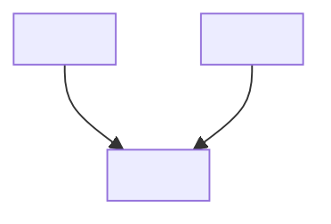

# Output Formats

The two formats covered in SKILL.md (Paper Card, Paper Table) handle ~80% of cases. This file covers the specialized formats for baselines, disambiguation, and reading notes.

## Baseline Recommendation

Use when the user asks for "a baseline with code", "implementation reference", or to pick a starting model.

```
📦 **Recommended Baseline: <Model Name>**
Paper: <Title> (<Year>, <Venue>) — <arXiv ID>
Code: <GitHub URL> ⭐ <stars> | Framework: <PyTorch/TF/JAX>
Performance: <key metric = value> on <dataset>
HuggingFace: <model page URL> | Downloads: <N>
Reproducibility: <High / Medium / Low / None>
Why this baseline: <one sentence — what makes it the right starting point>
```

Pick the baseline that scores well across:
1. **Code quality**: official repo, active maintenance, >100 stars
2. **SOTA position**: appears on a leaderboard for the relevant task
3. **Dataset access**: public datasets, no NDA
4. **Reproducibility**: Has someone reproduced the headline result?

Use `find_code.py` and `sota.py` to gather these signals.

## Disambiguation Report

Used in Branch 1 (POINT) when the query is ambiguous. Full structure in `disambiguation.md`. Short form:

```
🔍 Disambiguation: "<query>"
├── Resolution: <what the term refers to>
│   ├── Paper: <title> (<arXiv ID>)
│   └── Code: <GitHub URL>
└── Next: <what you'll search for>
```

## Reading Notes

When the user asks to read a paper (Branch 1, URL input), use the template at `assets/paper-summary-template.md`. Save to `artifacts/paper-notes/<paper-id>.md`.

Reading depth:

| Level | Goal | When | Output length |
|---|---|---|---|
| **L1 Technical** | Can reimplement | Building directly on the paper | Full template |
| **L2 Analytical** | Understand motivation + design choices | Most survey/ideation papers | Skip implementation details |
| **L3 Contextual** | Know what it is, where it fits | Quick scan | TLDR + 3 bullets |

Details in `reading-strategy.md`.

## Citation Graph Visualization

After citation traversal, if 4-15 nodes, optionally render as Mermaid:



Keep ≤ 30 nodes; beyond that, a table is more readable.

## Trending / Recent List

For arXiv monitoring or trending detection, augment the Paper Table with a TLDR column to help the user triage at a glance:

```
| # | Title | Authors | Date | Citations | TLDR |
|---|-------|---------|------|-----------|------|
```

For >10 papers, group by sub-topic if obvious clusters exist.
